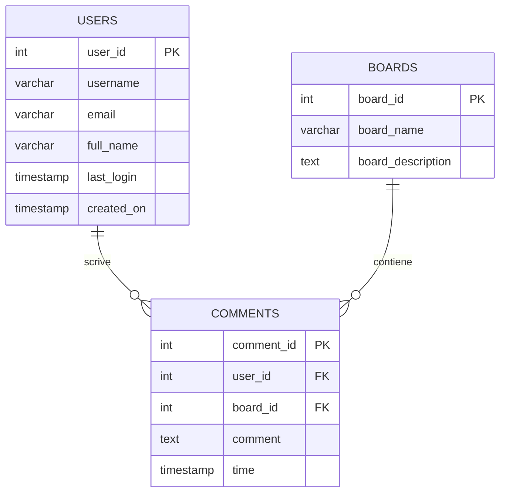

# Schemi ER: modellare i dati prima di scriverli

Prima di creare tabelle e scrivere query, c'è un passaggio fondamentale che molti principianti saltano — e che poi rimpiangono: **progettare lo schema dei dati**.

Uno **schema ER** (Entity-Relationship, o Entità-Relazione) è un diagramma concettuale che ti aiuta a capire *cosa* devi memorizzare e *come* le diverse informazioni si collegano tra loro. È come fare uno schizzo su carta prima di costruire una casa.

---

## Entità, attributi e relazioni

I tre concetti fondamentali di un modello ER sono:

- **Entità**: una "cosa" di cui vuoi tracciare i dati — ad esempio un utente, una bacheca, un ordine. Le entità diventano le tue **tabelle**.
- **Attributi**: le proprietà di un'entità — ad esempio `username`, `email`, `created_on`. Gli attributi diventano le **colonne** della tabella.
- **Relazioni**: i legami tra entità — ad esempio "un utente *scrive* molti commenti". Le relazioni diventano **chiavi esterne** (foreign key).

---

## Il nostro caso: un message board

Riprendiamo il database `message_boards` che abbiamo costruito nel corso. Le entità sono tre:

- `users` — gli utenti registrati
- `boards` — le bacheche tematiche
- `comments` — i messaggi pubblicati dagli utenti nelle bacheche

Ecco lo schema ER in forma di diagramma:



Leggendo il diagramma: un utente può scrivere **zero o più** commenti; una bacheca può contenere **zero o più** commenti; ogni commento appartiene a **esattamente un** utente e **esattamente una** bacheca.

---

## Cardinalità

La **cardinalità** descrive quanti elementi di un'entità possono essere associati agli elementi di un'altra. Le notazioni più comuni sono:

| Simbolo (Crow's Foot) | Significato           |
|-----------------------|-----------------------|
| `\|\|`                | esattamente uno       |
| `\|o`                 | zero o uno            |
| `}\|`                 | uno o più             |
| `}o`                  | zero o più            |

Nel nostro schema:
- `USERS ||--o{ COMMENTS` → un utente ha **zero o più** commenti
- `BOARDS ||--o{ COMMENTS` → una bacheca ha **zero o più** commenti

---

## Dalla relazione alla foreign key

Ogni relazione nel diagramma ER si traduce in codice SQL come una **foreign key**. Per esempio, la relazione "un commento appartiene a un utente" diventa:

```sql
user_id INT REFERENCES users(user_id) ON DELETE CASCADE
```

Il campo `user_id` nella tabella `comments` fa riferimento (`REFERENCES`) alla chiave primaria di `users`. PostgreSQL garantisce così che non puoi inserire un commento con un `user_id` che non esiste — è il database stesso che protegge l'integrità dei dati.

---

## Normalizzazione: evitare la ridondanza

Progettare bene uno schema significa anche **non ripetere dati inutilmente**. Questo processo si chiama **normalizzazione**.

Immagina di non avere la tabella `users` separata e di salvare il nome dell'utente direttamente in ogni commento:

```sql
-- ❌ Schema non normalizzato
CREATE TABLE comments (
  comment_id INTEGER PRIMARY KEY GENERATED ALWAYS AS IDENTITY,
  username VARCHAR(25),
  email VARCHAR(50),
  comment TEXT NOT NULL,
  time TIMESTAMP
);
```

Questo approccio ha diversi problemi:

- Se un utente cambia email, devi aggiornarla in **tutti** i suoi commenti.
- Se cancelli tutti i commenti di un utente, perdi anche i suoi dati anagrafici.
- I dati sono duplicati mille volte — spreco di spazio e rischio di inconsistenze.

La soluzione è tenere i dati degli utenti in una tabella separata e collegare i commenti tramite `user_id`. Questa è la **Prima Forma Normale (1NF)** in pratica: ogni informazione ha un posto solo.

### Le forme normali in breve

Esistono diverse "forme normali" (1NF, 2NF, 3NF…) che definiscono livelli progressivi di pulizia dello schema. Non devi memorizzarle tutte, ma vale la pena conoscere le prime tre:

- **1NF** — ogni campo contiene un solo valore atomico (no liste, no valori multipli in una cella).
- **2NF** — nessun attributo dipende solo da *parte* della chiave primaria (rilevante con chiavi composte).
- **3NF** — nessun attributo dipende da un altro attributo non-chiave (no dipendenze transitive).

In pratica: se ti ritrovi a duplicare dati tra tabelle, probabilmente c'è da normalizzare qualcosa.

---

## Quando *non* normalizzare (denormalizzazione)

La normalizzazione è quasi sempre la scelta giusta in fase di progettazione. Tuttavia, in sistemi ad altissima lettura (es. dashboard analytics, report) può essere utile fare **denormalizzazione controllata**: duplicare alcune informazioni per rendere le query più veloci, evitando JOIN costosi.

È una scelta avanzata da valutare caso per caso — nella maggior parte delle applicazioni web, uno schema normalizzato è più che sufficiente.

---

## Prima di scrivere codice, disegna lo schema

Quando inizi un nuovo progetto, l'abitudine migliore che puoi acquisire è questa: **prima di aprire il terminale, disegna il tuo schema ER** — anche su un foglio di carta.

Chiediti:
- Quali sono le entità principali del mio dominio?
- Quali attributi ha ciascuna?
- Come si relazionano tra loro? Con quale cardinalità?

Solo dopo aver risposto a queste domande, traduci tutto in `CREATE TABLE`. Ti risparmierà molte ore di refactoring in futuro.
