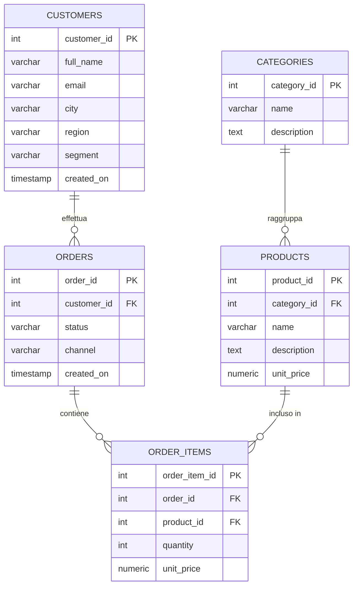

# Schemi ER: modellare i dati prima di scriverli

Prima di creare tabelle e scrivere query, c'è un passaggio fondamentale che molti principianti saltano — e che poi rimpiangono: **progettare lo schema dei dati**.

Uno **schema ER** (Entity-Relationship, o Entità-Relazione) è un diagramma concettuale che ti aiuta a capire *cosa* devi memorizzare e *come* le diverse informazioni si collegano tra loro. È come fare uno schizzo su carta prima di costruire una casa.

---

## Entità, attributi e relazioni

I tre concetti fondamentali di un modello ER sono:

- **Entità**: una "cosa" di cui vuoi tracciare i dati — ad esempio un cliente, un prodotto, un ordine. Le entità diventano le tue **tabelle**.
- **Attributi**: le proprietà di un'entità — ad esempio `full_name`, `email`, `unit_price`. Gli attributi diventano le **colonne** della tabella.
- **Relazioni**: i legami tra entità — ad esempio "un cliente *effettua* molti ordini". Le relazioni diventano **chiavi esterne** (foreign key).

---

## Il nostro caso: un e-commerce

Costruiremo il database `ecommerce`. Le entità principali sono cinque:

- `customers` — i clienti registrati
- `categories` — le categorie merceologiche dei prodotti
- `products` — il catalogo prodotti
- `orders` — gli ordini effettuati dai clienti
- `order_items` — le singole righe di ogni ordine (quale prodotto, quanti pezzi, a che prezzo)

Ecco lo schema ER completo:



Leggendo il diagramma: un cliente può effettuare **zero o più** ordini; ogni ordine contiene **una o più** righe; ogni riga fa riferimento a **esattamente un** prodotto; ogni prodotto appartiene a **esattamente una** categoria.

---

## Cardinalità

La **cardinalità** descrive quanti elementi di un'entità possono essere associati agli elementi di un'altra. Le notazioni più comuni sono:

| Simbolo (Crow's Foot) | Significato           |
|-----------------------|-----------------------|
| `\|\|`                | esattamente uno       |
| `\|o`                 | zero o uno            |
| `}\|`                 | uno o più             |
| `}o`                  | zero o più            |

Nel nostro schema:
- `CUSTOMERS ||--o{ ORDERS` → un cliente ha **zero o più** ordini
- `ORDERS ||--o{ ORDER_ITEMS` → un ordine ha **una o più** righe
- `CATEGORIES ||--o{ PRODUCTS` → una categoria raggruppa **zero o più** prodotti

---

## Dalla relazione alla foreign key

Ogni relazione nel diagramma ER si traduce in codice SQL come una **foreign key**. Per esempio, la relazione "un ordine appartiene a un cliente" diventa:

```sql
customer_id INT REFERENCES customers(customer_id) ON DELETE SET NULL
```

Il campo `customer_id` nella tabella `orders` fa riferimento (`REFERENCES`) alla chiave primaria di `customers`. PostgreSQL garantisce così che non puoi inserire un ordine con un `customer_id` che non esiste.

---

## Perché `order_items` è una tabella separata?

Questa è la domanda che fanno sempre i principianti. La risposta è la **normalizzazione**.

Immagina di salvare i prodotti acquistati direttamente dentro la tabella `orders`, come una stringa:

```sql
-- ❌ Schema non normalizzato
CREATE TABLE orders (
  order_id   INTEGER PRIMARY KEY GENERATED ALWAYS AS IDENTITY,
  customer_id INT,
  products   TEXT  -- "Notebook UltraSlim x1, Mouse wireless x2"
);
```

Questo approccio ha diversi problemi:

- Non puoi fare query su "quanti Notebook UltraSlim abbiamo venduto in totale".
- Non puoi calcolare il fatturato per categoria.
- Se cambia il nome di un prodotto, i dati storici diventano inconsistenti.

La soluzione è avere una tabella `order_items` separata, con una riga per ogni prodotto in ogni ordine. Questa è la **Prima Forma Normale (1NF)** in pratica: ogni informazione ha un posto solo e un formato atomico.

### Le forme normali in breve

Esistono diverse "forme normali" (1NF, 2NF, 3NF…) che definiscono livelli progressivi di pulizia dello schema. Non devi memorizzarle tutte, ma vale la pena conoscere le prime tre:

- **1NF** — ogni campo contiene un solo valore atomico (no liste, no valori multipli in una cella).
- **2NF** — nessun attributo dipende solo da *parte* della chiave primaria (rilevante con chiavi composte).
- **3NF** — nessun attributo dipende da un altro attributo non-chiave (no dipendenze transitive).

In pratica: se ti ritrovi a duplicare dati tra tabelle, probabilmente c'è da normalizzare qualcosa.

---

## Perché `unit_price` è sia in `products` che in `order_items`?

Ottima domanda — sembra una ridondanza, ma è una scelta intenzionale.

Il prezzo di un prodotto nel catalogo (`products.unit_price`) può cambiare nel tempo. Ma il prezzo pagato al momento dell'acquisto (`order_items.unit_price`) deve rimanere immutabile per sempre, altrimenti non potresti ricostruire correttamente il fatturato storico.

Questa tecnica si chiama **snapshot del dato** ed è molto comune nei sistemi transazionali e analitici.

---

## Quando *non* normalizzare (denormalizzazione)

La normalizzazione è quasi sempre la scelta giusta in fase di progettazione. Tuttavia, in sistemi ad altissima lettura (es. dashboard analytics, report) può essere utile fare **denormalizzazione controllata**: duplicare alcune informazioni per rendere le query più veloci, evitando JOIN costosi.

È una scelta avanzata da valutare caso per caso — nella maggior parte delle applicazioni, uno schema normalizzato è più che sufficiente.

---

## Prima di scrivere codice, disegna lo schema

Quando inizi un nuovo progetto, l'abitudine migliore che puoi acquisire è questa: **prima di aprire il terminale, disegna il tuo schema ER** — anche su un foglio di carta.

Chiediti:
- Quali sono le entità principali del mio dominio?
- Quali attributi ha ciascuna?
- Come si relazionano tra loro? Con quale cardinalità?

Solo dopo aver risposto a queste domande, traduci tutto in `CREATE TABLE`. Ti risparmierà molte ore di refactoring in futuro.
