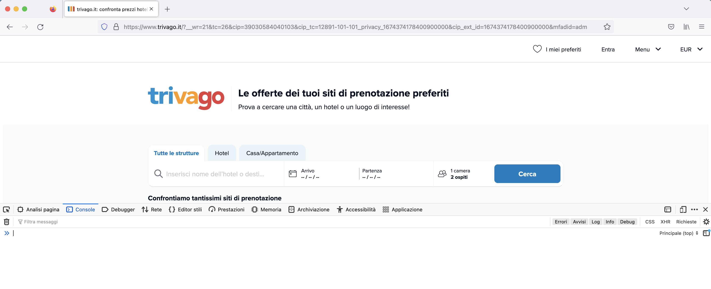
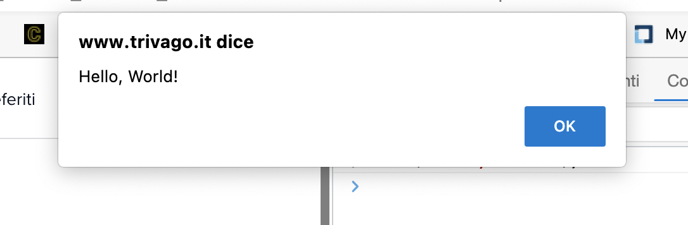

# Includere JavaScript

I browser moderni supportano tre modi diversi di includere JavaScript nelle nostre pagine HTML. Questi tre modi sono **esterno**, **interno** ed **inline**. Prima di mostrarli però assumiamo di avere una semplice pagina HTML così definita:

```html
<!DOCTYPE html>
<html>
  <head>
    <title>Finanza.tech</title>
  </head>
  <body>
  </body>
</html>
```

A questo punto possiamo vedere come includere i nostri file JavaScript in questa pagina HTML.

## JavaScript esterno

Puoi includere qualsiasi file JavaScript esterno (un file con estensione `.js`) assegnando al tag `script` un attributo `src`. L'attributo `src` specifica la posizione del file JavaScript. L'attributo src può essere utilizzato per includere file JavaScript dal file system locale o dal Web. L'attributo src può essere utilizzato anche per includere file JavaScript da una CDN.

:::tip
Una CDN consente di trasferire velocemente le risorse necessarie per caricare i contenuti Internet, incluse pagine HTML, file javascript, fogli di stile, immagini e video. La popolarità dei servizi CDN continua ad aumentare e, ad oggi, la maggior parte del traffico Web viene servito attraverso CDN, compreso il traffico da siti importanti come Facebook, Netflix e Amazon.
:::

Il valore di `src` è solo il percorso del file che vuoi includere. Questo percorso può essere sia **relativo**, in questo modo:

```html
<script src="./script.js"></script>
```

o anche **assoluto**, per esempio:

```html
<script src="https://cdn.finanzatech.io/script.js"></script>
```

Posiziona il tag di script subito prima del tag di chiusura del `body`, in questo modo:

```html
<!DOCTYPE html>
<html>
  <head>
    <title>Finanza Tech</title>
  </head>
  <body>
    <h1>Contenuto della pagina</h1>

    <!-- i tuoi import JavaScript qui -->
    <script src="./script.js"></script>
  </body>
</html>
```

## JavaScript interno

Oltre al caricamento di un file esterno è possibile aggiungere anche codice JavaScript direttamente all'interno di una pagina HTML. Per farlo basta aggiungere un tag `<script></script>` che conterrà al suo interno il codice JavaScript che desiderate:

```html
<!DOCTYPE html>
<html>
  <head>
    <title>Finanza Tech</title>
  </head>
  <body>
    <h1>Contenuto della pagina</h1>

    <script>
      console.log('Hello, World!')
    </script>
  </body>
</html>
```

Eseguendo questa pagina dovreste vedere nella console del vostro browser la scritta *"Hello, World!"*.

## JavaScript inline

Un modo ulteriore di includere JavaScript nelle nostre pagine è farlo inline, per esempio potete aggiungere un frammento di codice quando viene premuto un pulstante:

```html
<!DOCTYPE html>
<html>
  <head>
    <title>Finanza Tech</title>
  </head>
  <body>
    <h1>Contenuto della pagina</h1>

    <button onclick="console.log('Hello, World!');">Cliccami</button>
  </body>
</html>
```

Così come per lo script precedente anche questo produrrà, al click del pulsante, la scritta nella console del browser *"Hello, World!"*.

## La console degli sviluppatori

I browser moderni dispongono di strumenti di sviluppo integrati per funzionare con JavaScript e altre tecnologie web. Questi strumenti includono la console che è simile a un'interfaccia shell, insieme a strumenti per ispezionare il DOM, eseguire il debug e analizzare l'attività di rete.

La console può essere utilizzata per registrare informazioni come parte del processo di sviluppo JavaScript, nonché consentire di interagire con una pagina Web eseguendo espressioni JavaScript all'interno del contesto della pagina. In sostanza, la console ti offre la possibilità di scrivere, gestire e monitorare JavaScript su richiesta.

Questo tutorial spiega come lavorare con la console e JavaScript nel contesto di un browser e fornirà una panoramica di altri strumenti di sviluppo integrati che potresti utilizzare come parte del tuo processo di sviluppo web.

### I browser

La maggior parte dei browser Web moderni che supportano HTML e XHTML basati su standard ti forniranno l'accesso a una console per sviluppatori in cui puoi lavorare con JavaScript in un'interfaccia simile a una shell di terminale. Questa sezione illustra come accedere alla console in Firefox e Chrome.

#### Firefox

Per aprire la console Web in FireFox, vai al menu ☰ nell'angolo in alto a destra accanto alla barra degli indirizzi. Seleziona __Altri strumenti__ Successivamente, clicca sulla voce __Strumenti di sviluppo web__. Dopo averlo fatto, si aprirà un vassoio nella parte inferiore della finestra del browser:



#### Chrome o Edge

Per aprire la console JavaScript in Chrome o Edge, puoi accedere al menu in alto a destra della finestra del browser indicato da tre punti verticali. Da lì, puoi selezionare __Altri strumenti__ quindi __Strumenti per sviluppatori__.


### Lavorare con la console

All'interno della console, puoi digitare ed eseguire codice JavaScript. Inizia con un avviso che stampa la stringa `Hello, World!`:

```javascript
> alert("Hello, World!");
```

Una volta premuto il `ENTER` tasto che segue la riga di JavaScript, nel browser verrà visualizzato un popup di avviso:



Si noti che la console stamperà anche il risultato della valutazione di un'espressione, che leggerà come undefinedquando l'espressione non restituisce esplicitamente qualcosa.

Invece di avere avvisi pop-up da cui devi fare clic, puoi lavorare con JavaScript accedendo alla console con console.log.

Per stampare `Hello, World!` come una stringa, digitare quanto segue nella console:

```javascript
> console.log("Hello, World!")
```

All'interno della console, riceverai il seguente output:

```javascript
> console.log("Hello, World!")
Hello, World!
< undefined
```

Puoi anche eseguire operazioni matematiche. Per esempio:

```javascript
> console.log(5 + 3)
8
< undefined
```

Oppure lavorare con più variabili e su più righe:

```javascript
> let today = new Date();
> console.log("Today's date is " + today);
Today's date is Sun Jan 22 2023 09:44:01 GMT+0100 (Ora standard dell’Europa centrale)
undefined
```

Se devi modificare un comando che hai passato attraverso la Console, puoi digitare il tasto freccia su ( ↑ ) sulla tastiera per recuperare il comando precedente. Ciò ti consentirà di modificare il comando e inviarlo di nuovo.

La console JavaScript ti offre uno spazio per provare il codice JavaScript in tempo reale consentendoti di utilizzare un ambiente simile a un'interfaccia della shell del terminale.
