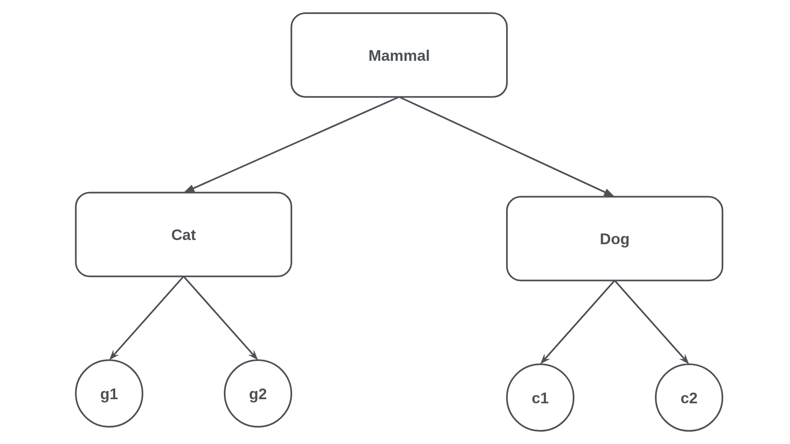
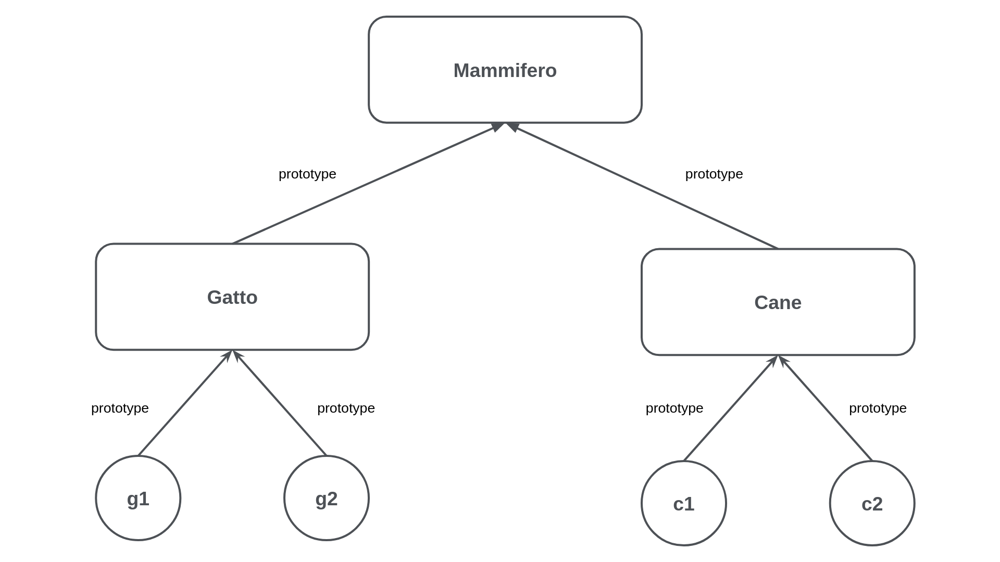

# Classi, prototipi ed ereditarietà

Nei paragrafi precedenti abbiamo discusso degli oggetti. In particolare abbiamo visto come creare un oggetto e come è possibile definirne le proprietà. Quando creiamo un oggetto in JavaScript implicitamente viene creata una proprietà speciale definita come **[[prototype]]**. Questà proprietà speciale altro non è che un riferimento implicito ad un altro oggetto che viene interrogata nella ricerca di proprietà.

Se un oggetto non possiede una specifica proprietà, viene controllato il prototipo dell'oggetto per quella proprietà. Se il prototipo dell'oggetto non ha quella proprietà, viene controllato il prototipo di quell'oggetto e così via. Ecco come funziona l'ereditarietà in JavaScript, attraverso questa proprietà speciale che ogni oggetto, o quasi, possiede ed è anche per questo che in JavaScript l'ereditarietà viene chiamata prototipale. Ne esploreremo in dettaglio il funzionamento nei prossimi paragrafi.

## Object.create

In JavaScript questo metodo può essere utilizzato per creare oggetti e può essere utilizzato per sostituire l'operatore `new`, visto in precedenza. Possiamo utilizzarlo per creare un nuovo oggetto basandoci su un oggetto definito, con un suo ben specifico prototipo, e assegnarlo ad un altro. Per esempio:

```javascript
const anotherObject = {
  a: 2
}

// crea un oggetto collegato a anotherObject
const myObject = Object.create(anotherObject)

myObject.a // il valore sarà 2
```

Quindi, abbiamo `myObject` che ora è collegato ad `anotherObject`. Chiaramente `myObject.a` non esiste ma, tuttavia, l'accesso alla proprietà ha esito positivo (trovandosi su `anotherObject`) e infatti trova il valore 2.

## Ereditarietà

Sostanzialmente in JavaScript si ottiene con una catena di **prototype**. Esistono diversi modi per creare questa catena di prototipi, ma in questo libro analizzeremo i più comuni:

* Funzionale
* Funzioni costruttore
* Classi

Utilizzando **prototype** possiamo aggiungere nuove proprietà e metodi a un costruttore di oggetti esistente. Possiamo quindi essenzialmente dire al nostro codice JavaScript di ereditare le proprietà da un prototipo. Questa catena di prototipi ci consente di riutilizzare le proprietà ed i metodi da un oggetto JavaScript a un altro tramite una funzione puntatore al riferimento. Volendo fare un paragone rispetto all'ereditarietà classica partiamo da un semplice esempio. Consideriamo la seguente catena di ereditarietà:



Nell'ereditarietà classica le classi **Cat** e **Dog** ereditano i comportamenti dalla classe **Mammal**, mentre **g1**, **g2** sono istanze della classe Gatto e **c1**, **c2** sono istanze della classe Cane. In JavaScript, invece le cose cambiano radicalmente quando parliamo di ereditarietà:



In questo caso, invece, **g1** e **g2** sono prototipi di **Cat**, mentre **c1** e **c2** sono prototipi di **Dog**. **Dog** e **Cat** sono a loro volta prototipi di **Mammal**.

### L'ereditarietà funzionale

Per creare le catene di prototipi con questa metodologia basta usare la funzione `Object.create` mostrata precedentemente. Vediamo come farlo con un esempio:

```javascript
const mammal = {
  introduceYourself: function () {
    console.log(`Hello I'm a ${this.type} and my name is: ${this.name}`)
  }
}

const cat = Object.create(mammal, {
  type: { value: 'cat' },
  noise: { value: 'meow' },
  meow: { value: function () {
    console.log(`I ${this.noise}: MEEEEEOOOOOW`)
  }}
})

const dog = Object.create(mammal, {
  type: { value: 'dog' },
  noise: { value: 'bark' },
  woof: { value: function () {
    console.log(`I ${this.noise}: WOOF WOOF`)
  }}
})

const fuffy = Object.create(cat, { 
  name: { value: 'Fuffy' } 
})
fuffy.introduceYourself()
fuffy.meow()

const bobby = Object.create(dog, {
  name: { value: 'Bobby' }
})
bobby.introduceYourself()
bobby.woof()
```

Provando ad eseguire il codice dalla linea di comando il risultato che otterrete sarà il seguente:

```javascript
Hello I'm a cat and my name is: Fuffy
I meow: MEEEEEOOOOOW
Hello I'm a dog and my name is: Bobby
I bark: WOOF WOOF
```

L'oggetto `mammal` è un semplice oggetto JavaScript, creato utilizzando le parentesi graffe {}. Il prototipo di oggetti semplici come questo è Object.prototype. Utilizzando la funzione `Object.create`,descritta in precedenza, abbiamo creato gli oggetti `dog` e `cat` passando come primo argomento il prototipo dell'oggetto desiderato, in questo caso `mammal`. Quindi `mammal` è il prototipo di dog e `cat`. Quando vengono creati gli oggetti `bobby` e `fuffy` vengono passati come primo argomento della funzione `Object.create` rispettivamente `dog` e `cat`. Quindi dog è il prototipo di `bobby` e `cat` è il prototipo di `fuffy`. Quindi volendo descrivere l'intera catena di prototipi:

* Il prototipo di `fuffy` è `cat`;
* Il prototipo di `bobby` è `dog`;
* Il prototipo di `dog` e `cat` è `mammal`;
* Il prototipo di `mammal` è Object.prototype.

Analizzando i passaggi effettuati da `fuffy.introduceYourself()` (allo stesso modo vengono fatti da `bobby.introduceYourself()`), cerchiamo di capire ancora meglio quali passaggi vengono effettuati:

* Viene controllato se `fuffy` ha una proprietà `introduceYourself`; non è così;
* Viene controllato se il prototipo di `fuffy`, quindi `cat`, ha una proprietà `introduceYourself`; non è così;
* Viene controllato se il prototipo di `cat`, `mammal`, ha una proprietà `introduceYourself`; la esegue;
* Esegue la funzione `introduceYourself` su `fuffy`, quindi tipologia di `mammal`, `this.type` sarà _"cat"_ e `this.name` sarà _"Fuffy"_.

Per completare il paradigma funzionale applicato all'eredità prototipale, la creazione di un'istanza di un cane e di un gatto può essere generalizzata con una funzione:

```javascript
...
function createCat (name) {
  return Object.create(cat, {
    name: { value: name }
  })
}

function createDog (name) {
  return Object.create(dog, {
    name: { value: name }
  })
}

const fuffy = createCat('Fuffy')
fuffy.introduceYourself()
fuffy.meow()

const bobby = createDog('Bobby')
bobby.introduceYourself()
bobby.woof()
```

Il prototipo di un oggetto può essere ispezionato con `Object.getPrototypeOf`:

```javascript
console.log(Object.getPrototypeOf(fuffy) === cat) //true
console.log(Object.getPrototypeOf(bobby) === dog) //true
```

Eseguendo lo script con tutte le modifiche appena descritte il risultato sarà:

```
Hello I'm a cat and my name is: Fuffy
I meow: MEEEEEOOOOOW
Hello I'm a dog and my name is: Bobby
I bark: WOOF WOOF
true
true
```

### L'ereditarietà con le funzioni costruttore

Questo approccio è molto utilizzato e semplice, basta dichiarare una funzione e richiamarla utilizzando la parola chiave **new**. Riprendiamo l'esempio fatto in precedenza e analizziamo il codice:

```javascript
function Mammal (name) {
  this.name = name
}

Mammal.prototype.introduceYourself = function () {
  console.log(`Hello I'm a ${this.type} and my name is: ${this.name}`)
}

function Cat (name) {
  this.type = 'cat'
  this.noise = 'meow'
  Mammal.call(this, name)
}

Cat.prototype.meow = function () {
  console.log(`I ${this.noise}: MEEEEOOOOW`)
}

Object.setPrototypeOf(Cat.prototype, Mammal.prototype)

function Dog (name) {
  this.type = 'dog'
  this.noise = 'bark'
  
  Mammal.call(this, name)
}

Dog.prototype.woof = function () {
  console.log(`Io ${this.noise}: WOOF WOOF`)
}

Object.setPrototypeOf(Dog.prototype, Mammal.prototype)

const fuffy = new Cat('Fuffy')
fuffy.introduceYourself()
fuffy.meow()

const bobby = new Dog('Bobby')
bobby.introduceYourself()
bobby.woof()
```

Non c'è da meravigliarsi se anche in questo caso il risultato è:

```
Hello I'm a cat and my name is: Fuffy
I meow: MEEEEEOOOOOW
Hello I'm a dog and my name is: Bobby
I bark: WOOF WOOF
true
true
```

Le funzioni costruttore `Doc`, `Cat` e `Mammal` hanno la prima lettera maiuscola. Così come nell'OOP (_Object Oriented Programming_) in generale è una convenzione anche in questo caso lo è.

Quando viene eseguito `new Cat('Fuffy')`, viene creata una nuova istanza (*fuffy*) di `Cat`. Questo nuovo oggetto è anche l'oggetto *this* all'interno della funzione costruttore `Cat`. Quest'ultima, a sua volta, passa il riferimento di sè stesso, **this**, a `Mammal.call`. L'utilizzo di questo metodo consente di impostare **this** della funzione chiamata attraverso il primo argomento che gli è stato passato. Quindi, quando questo viene passato a `Mammal.call`, viene creato un riferimento anche all'oggetto appena creato (che alla fine viene assegnato a **fuffy**) tramite l'oggetto **this** all'interno della funzione di costruzione `Cat`. Tutti gli argomenti successivi passati alla chiamata diventano argomenti delle funzione, quindi l'argomento `name` passato a `Mammal` è _"Fuffy"_. Il costruttore di `Mammal` imposta `this.name` con _"Fuffy"_, il che significa che alla fine `fuffy.name` sarà anch'esso _"Fuffy"_. Quindi volendo descrivere l'intera catena di prototipi che si è creata:

* Il prototipo di **fuffy** è `Cat.prototype`;
* Il prototipo di **bobby** è `Dog.prototype`;
* Il prototipo di **Cat** e **Dog** è `Mammal.prototype`;
* Il prototipo di **Mammal** è `Object.prototype`.

### L'ereditarietà con le classi

Abbiamo visto che il modello orientato agli oggetti di JavaScript si basa sui costruttori e sull'ereditarietà basata sui prototipi. Bene, le classi sono solo una nuova sintassi per il modello esistente. Le classi non introducono un nuovo modello orientato agli oggetti in JavaScript. Le classi mirano a fornire una sintassi molto più semplice e chiara per gestire i costruttori e l'ereditarietà.

In effetti, le classi sono funzioni. Le classi sono solo una nuova sintassi per la creazione di funzioni utilizzate come costruttori, infatti se utilizzate se dalla linea di comando digitate:

```
$ js -p "typeof class Mammal {}"
function
```

#### Creare una classe

La creazione di funzioni utilizzando le classi che non vengono utilizzate come costruttori non ha alcun senso e non offre vantaggi. Piuttosto, rende il codice difficile da leggere, poiché diventa confuso. L’utilizzo di `class` altro non fa che ridurre il numero di linee di codice, aumentando di conseguenza la leggibilità, utile alla creazione di catene di prototipi.

Dichiarare una classe è molto semplice, basta utilizzare la parola chiave `class` seguita dal nome della classe. Per esempio ecco come possiamo dichiarare la classe `Mammal`:

```javascript
class Mammal {
  constructor (name) {
    this.name = name
  }
}

const mammal = new Mammal('Fuffy')
console.log(mammal.name) // Stampa a video "Fuffy"
```

Qui abbiamo dichiarato una classe denominata `Mammal`. Poi, abbiamo definito un metodo `constructor` al suo interno. Infine, abbiamo creato un'istanza della classe `Mammal`, e abbiamo stampato la proprietà `name` dell'oggetto appena creato. 

Le classi vengono trattate come funzioni e internamente il nome della classe viene considerato come il nome della funzione e il corpo del metodo del costruttore viene considerato come il corpo della funzione. Può esserci un solo costruttore dichiarato all'interno di una classe. La definizione di più di un costruttore genererà l'eccezione `SyntaxError`.

Il metodo del costruttore in ogni classe equivale al corpo della funzione di una funzione costruttore. Quindi l'esempio mostrato in precedenza equivale al seguente:

```javascript
function Mammal (name) {
  this.name = name
}

const mammal = new Mammal('Fuffy')
console.log(mammal.name) // Stamperà "Fuffy"
```

#### I metodi prototype

Tutti i metodi implementati all'interno della classe vengono aggiunti alla porietà `prototype` della nostra classe. La proprietà `prototype` è il prototipo degli oggetti creati utilizzando `class`.

```javascript
class Mammal {
  constructor (name) {
    this.name = name
  }  

  introduceYourself () {
    console.log(`Hello, my name is ${this.name}`)
  }
}

const mammal = new Mammal('Fuffy')
mammal.introduceYourself() // Stamperà "Hello, my name is Fuffy"
```

Il codice appena mostrato è lo stesso del seguente utilizzando le funzioni:

```javascript
function Mammal (name) {
  this.name = name
}

Mammal.prototype.introduceYourself = function () {
  console.log(`Hello, my name is ${this.name}`)
}

const mammal = new Mammal('Fuffy')
mammal.introduceYourself() // Stamperà "Hello, my name is Fuffy"
```

#### I metodi get e set

In precedenza abbiamo visto come è possibile aggiungere proprietà agli oggetti utilizzando il metodo `Object.defineProperty()`. Ora invece vedremo come farlo all'interno delle classi con i prefissi `get` e `set` per i metodi. Questi metodi possono essere aggiunti ai valori dell'oggetto e alle classi per definire gli attributi `get` e `set` delle proprietà.
Quando i metodi `get` e `set` vengono utilizzati nel corpo di una classe, vengono aggiunti alla proprietà `prototype` della classe.

Ecco un esempio per dimostrare come definire i metodi get e set in una classe:

```javascript
class Mammal {
  constructor (name) {
    this._name = name
  }

  get name () {
    return this._name
  }

  set name (name) {
    this._name = name
  }

  introduceYourself () {
    console.log(`Hello, my name is ${this._name}`)
  }
}
```

```javascript
const mammal = new Mammal('Fuffy')
mammal.introduceYourself() // Stamperà "Hello, my name is Fuffy"

mammal.name = 'Kitty'
mammal.introduceYourself() // Stamperà "Hello, my name is Kitty"
```

Anche in questo caso il codice appena mostrato può essere riscritto utilizzando le funzioni:

```javascript
function Mammal (name) {
  this._name = name
}

Mammal.prototype.introduceYourself = function () {
  console.log(`Hello, my name is ${this._name}`)
}

Object.defineProperty(Mammal.prototype, 'name', {
  get: function () { 
    return this._name 
  },
  set: function (newValue) { 
    this._name = newValue
  }
})

const mammal = new Mammal('Fuffy')
mammal.introduceYourself() // Stamperà "Hello, my name is Fuffy"

mammal.name = 'Kitty'
mammal.introduceYourself() // Stamperà "Hello, my name is Kitty"
```

#### La catena di prototipi, l'ereditarietà

In precedenza in questo capitolo, abbiamo visto quanto fosse difficile implementare la gerarchia di ereditarietà nelle funzioni. Pertanto, l'utilizzo delle classi mira a renderlo facile introducendo la clausola `extends` e la parola chiave `super`.

Utilizzando la clausola `extends`, una classe può ereditare proprietà statiche e non statiche di un altro costruttore. La parola chiave `super`, invece, viene utilizzata in due modi:

* Viene utilizzato nel costruttore di una classe per invocare il costruttore padre.
* Viene utilizzato nei metodi di una classe per invocare i metodi statici e non di una classe padre.

Riprendiamo ora il nostro esempio e ricostruiamo la nostra catena di prototipi utilizzando le classi:

```javascript
class Mammal {
  constructor (name) {
    this.name = name
  }
  
  introduceYourself () {
    console.log(`Hello I am ${this.type} and my name is: ${this.name}`)
  }
}

class Cat extends Mammal {
  constructor (name) {
    super(name)
    this.noise = 'meow'
    this.type = 'cat'
  }

  meow () {
    console.log(`I ${this.noise}: MEEEEOOOOW`)
  }
}

class Dog extends Mammal {
  constructor (name) {
    super(name)
    this.noise = 'bark'
    this.type = 'dog'
  }

  woof () {
    console.log(`I ${this.noise}: WOOF WOOF`)
  }
}

const fuffy = new Cat('Fuffy')
fuffy.introduceYourself()
fuffy.meow()

const bobby = new Dog('Bobby')
bobby.introduceYourself()
bobby.woof()
```

Anche in questo caso la catena di prototipi sarà:

* Il prototipo di **fuffy** è `Cat.prototype`;
* Il prototipo di **bobby** è `Dog.prototype`;
* Il prototipo di **Dog** e **Cat** è `Mammal.prototype`;
* Il prototipo di **Mammal** è `Object.prototype`.

La parola chiave `extends` rende l’ereditarietà prototipale molto più semplice. Nel codice di esempio, la classe `Dog extends Mammal` assicurerà che il prototipo di `Dog.prototype` sarà `Mammal.prototype`. In altre parole equivale alla seguente sintassi utilizzata negli esempi precedenti:

```javascript
Object.setPrototypeOf(Dog.prototype, Mammal.prototype)
```

La parola chiave `super` nel metodo del `constructor` della classe `Dog` è un modo generico per chiamare il costruttore della classe genitore impostando this sull’istanza corrente. Nell’esempio della funzione costruttore equivale a:

```javascript
function Dog (name) {
  ...
  Mammal.call(this, name)
}
```

## Esercizi

### Esercizio 1 — Classe Prodotto

Crea una classe `Prodotto` con getter, metodi di istanza e un metodo statico.

```javascript
class Prodotto {
  constructor(nome, prezzo, categoria) {
    // il tuo codice
  }

  get prezzoFormattato() {
    // restituisce "€1299.99"
  }

  applicaSconto(percentuale) {
    // riduce this.prezzo della percentuale indicata
  }

  static confrontaPrezzo(p1, p2) {
    // restituisce il prodotto con prezzo minore
  }
}

const laptop = new Prodotto('Laptop Pro', 1299.99, 'Elettronica')
const mouse = new Prodotto('Mouse Wireless', 29.99, 'Accessori')

console.log(laptop.prezzoFormattato)              // €1299.99
laptop.applicaSconto(10)
console.log(laptop.prezzoFormattato)              // €1169.99

const economico = Prodotto.confrontaPrezzo(laptop, mouse)
console.log(economico.nome)                       // Mouse Wireless
```

### Esercizio 2 — Ereditarietà con ProdottoDigitale

Estendi `Prodotto` con una classe `ProdottoDigitale` che aggiunge un formato file e uno sconto digitale aggiuntivo del 5%.

```javascript
class ProdottoDigitale extends Prodotto {
  constructor(nome, prezzo, categoria, formatoFile) {
    super(nome, prezzo, categoria)
    this.formatoFile = formatoFile
  }

  applicaSconto(percentuale) {
    // applica la percentuale richiesta + 5% automatico
    // usa super.applicaSconto per riutilizzare la logica padre
  }
}

const corso = new ProdottoDigitale('Corso JavaScript', 99.00, 'Formazione', 'MP4')
corso.applicaSconto(20) // 20% + 5% digitale = 25%
console.log(corso.prezzoFormattato) // €74.25
console.log(corso.formatoFile)      // MP4
```

### Esercizio 3 — Classe Carrello

Crea una classe `Carrello` che gestisce una lista di prodotti con metodi per aggiungere, rimuovere e calcolare il totale.

```javascript
class Carrello {
  constructor() {
    this.items = []
  }

  aggiungi(prodotto, quantita) { /* ... */ }
  rimuovi(nomeProdotto) { /* ... */ }
  totale() { /* usa reduce */ }
  svuota() { /* ... */ }

  get riepilogo() {
    // restituisce stringa formattata con tutti gli items e il totale
  }
}

const carrello = new Carrello()
carrello.aggiungi(new Prodotto('Laptop Pro', 1299.99, 'Elettronica'), 1)
carrello.aggiungi(new Prodotto('Mouse Wireless', 29.99, 'Accessori'), 2)

console.log(carrello.totale())   // 1359.97
console.log(carrello.riepilogo)
// - Laptop Pro x1: €1299.99
// - Mouse Wireless x2: €59.98
// Totale: €1359.97

carrello.rimuovi('Mouse Wireless')
console.log(carrello.totale())   // 1299.99
```