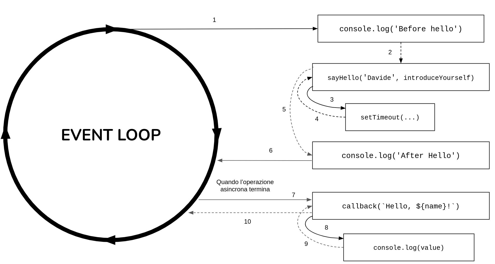
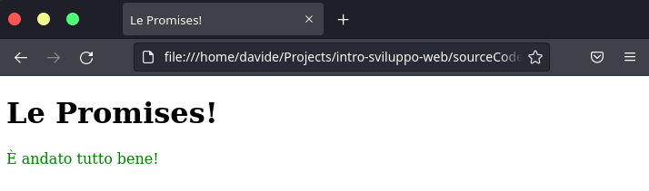
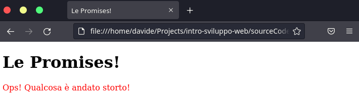
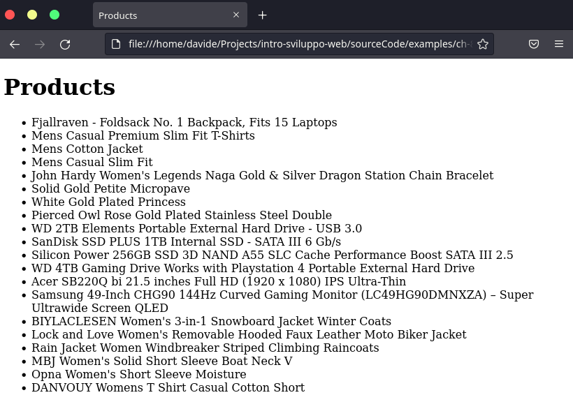

# La programmazione asincrona

Il modello di programmazione asincrono non ci consente di essere predittivi sull'ordine in cui le cose accadranno. Usando questo modello, se si avvia un'azione il programma continua ad essere eseguito restituendo subito il controllo al chiamante.

Questo può causare non pochi problemi ai programmatori che provengono da linguaggi sincroni, come PHP, Java o C#, in cui una funzione ritorna solo dopo che ha svolto il proprio lavoro. Ciò ha lo svantaggio che le richieste successive verranno eseguite solo al termine della precedente. Di conseguenza il tempo totale impiegato sarà la somma di tutti i tempi di risposta. Un altro aspetto da considerare è che in un modello di programmazione sincrono il fatto che si debba aspettare che un'azione termini è implicito, mentre nella programmazione asincrona è esplicito.

Alla fine di questo capitolo sarete in grado di utilizzare:

* Le Callbacks
* Le Promises

## Le callbacks

In JavaScript è possibile passare una funzione come argomento ad un'altra funzione. Nella programmazione asincrona in generale operazioni come leggere un file, o effettuare una richiesta HTTP ad un servizio restful, sono operazioni che vengono lanciate ed il controllo viene restituito al chiamante. Questo vuol dire che tutte le istruzioni che successive vengono eseguite immediatamente, anche se l'operazione precedente non è completata. In uno scenario come quello appena descritto, abbiamo la necessità di avere un meccanismo che ci avvisi quando l'operazione termina con successo, ma anche quando si è verificato qualche errore. Un meccanismo per ricevere questi risultati al termine dell'operazione è quello di passare una funzione come parametro di un altra funzione, la quale verrà richiamata al termine dell'operazione. Queste funzioni passate come parametro prendono il nome di *callback*. Le callback sono un concetto generale, identifica solo il meccanismo con cui il risultato viene propagato e non è utilizzato solo ed esclusivamente nella programmazione asincrona. 

Facciamo un piccolo esempio per comprenderne meglio il funzionamento. Immaginate una semplice funzione `sayHello`, che prende in input una variabile `name`, e restituisca una stringa che rappresenta un saluto personalizzato:

```javascript
function sayHello (name) {
  return `Hello, ${name}!`
}

const result = sayHello('Davide')
console.log(result)
```

Non c'è nulla di speciale in questo piccolo esempio. Quando la funzione `sayHello` viene richiamata, elabora una piccola stringa e la restituisce con un'istruzione `return`. Questo viene definito anche come *stile diretto* ed è, per chi proviene dalla programmazione sincrona, il modo più comune di restituire un risultato. Eseguendo il codice quello che otterremo quanto segue:

```
Hello, Davide!
```

Ora vediamo come trasformare la funzione `sayHello` facendo in modo che utilizzi una funzione di callback:

```javascript
function sayHello (name, callback) {
  callback(`Hello, ${name}!`)
}

function introduceYourself (value) {
  console.log(value)
}

sayHello('Davide', introduceYourself)
```

Abbiamo sostituito l'istruzione `return` con l'invocazione alla funzione `introduceYourself` inviata come parametro. Di conseguenza il valore di ritorno verrà passato direttamente a questa funzione, la quale si occuperà di stampare il risultato. Inoltre la funzione `sayHello` è sincrona, infatti completerà al sua esecuzione solo quando terminerà quella della funzione `introduceYourself`. Aggiungiamo due `console.log` al codice che confermano quanto appena detto:

```javascript
console.log('Before hello')
sayHello('Davide', introduceYourself)
console.log('After hello')
```

Eseguendo lo script a video comparirà quanto segue:

```
Before hello
Hello, Davide!
After hello
```

Modifichiamo adesso la funzione `sayHello` in modo che diventi asincrona e vediamo come il comportamento del nostro script cambia radicalmente:


```javascript
function sayHello (name, callback) {
  setTimeout(function () {
    callback(`Hello, ${name}!`)
  }, 1000)
}
...
```

Nel frammento di codice mostrato, abbiamo utilizzato `setTimeout()` per simulare una chiamata asincrona della callback. `setTimeout()` esegue la funzione passatagli come parametro dopo il numero di millisecondi specificato (nel nostro caso un secondo). Questa è chiaramente un'operazione asincrona, e quindi un qualcosa che avverrà nel futuro. Ora se proviamo ad eseguire lo script con la modifica effettuata, vediamo come il risultato cambia radicalmente:

```
Before hello
After hello
Hello, Davide!
```

Vediamo schematicamente come funziona:



Analizziamo punto per punto cosa accade:

1. Il modulo principale inizia la sua esecuzione e stampa a video `Before hello`.

2. Successivamente esegue la funzione `sayHello`. 

3. Questa funzione esegue `setTimeout`, 

4. `SetTimeout` non aspetta che venga eseguita la callback, ma restituisce subito il controllo al chiamante.

5. Il chiamante di `setTimeout` termina la sua esecuzione in quanto non ha altre istruzioni da eseguire. di conseguenza a sua volta `sayHello` restituisce il controllo al chiamante

6. Il modulo principale, stampa a video `After hello`.

7. Una volta scaduto il timer, la callback viene eseguita e quindi a video comparirà la scritta `Hello, Davide!`.

## Le promises

Le promises (promesse) sono parte dello standard ECMAScript 2015 (o ES6 dirsivoglia), e sono state aggiunte nativamente a partire dalla versione 4 di Node.js. Le promises rappresentano un gran passo avanti nella gestione della propagazione dei risultati delle operazioni asincrone basate su callbacks viste in precedenza. Come vedremo più avanti, le promises rendono il codice asincrono più leggibile e robusto rispetto all'alternativa basata su callback.

### Cos'è una Promise?

Una `Promise` è semplicemente un oggetto che può produrre un risultato, o un errore, di una operazione asincrona in un determinato momento nel futuro. Una `Promise` può trovarsi in tre stati possibili: 

* *Pending*: quando l'operazione asincrona non è ancora terminata.
* *Respinta*: quando l'operazione asincrona è terminata con un errore. La funzione `onRejected()` viene invocata.
* *Risolta*: quando l'operazione asincrona è terminata con un esito positivo. La funzione `onFulfilled()` viene invocata.
* *Saldata*: quando l'operazione asincrona non è in *pending* (con un errore o con successo).

Uno standard per le promises è stato definito dalla comunità, questo standard prende il nome di https://promisesaplus.com/implementations[Promises/A+]. Ci sono molte implementazioni conformi allo standard, incluso lo standard JavaScript che ECMAScript promises.

Le promises devono seguire una serie di regole ben definite:

* Una promise o _"thenable"_ è un oggetto che fornisce un metodo `.then()` conforme allo standard.
* Una promise in pending può passare a uno stato risolta o respinta.
* Una promise risolta o respinta è saldata e non deve passare in nessun altro stato.
* Una volta saldata una promise, deve avere un valore (che può essere `undefined`). Quel valore non deve cambiare.

Ogni istanza di `Promise` deve avere un metodo `then()` con la firma seguente

```javascript
myPromise.then(onFulfilled, onRejected)
```

Nella firma appena mostrata `myPromise` è un'istanza di `Promise` creata utilizzando l'operatore `new`. Il costruttore di `Promise` crea una nuova istanza che viene risolta o respinta in base alla funzione che viene fornita come argomento. La funzione fornita al costruttore riceverà due argomenti:

```javascript
new Promise((resolve, reject) => {})
```

Le promises non espongono il loro stato interno. Piuttosto pensate alla promise come una scatola nera. Solo la funzione responsabile della creazione della promise sarà a conoscenza del suo stato o dell'accesso per risolverla o rifiutarla. Notiamo che il costruttore di `Promise` prende in input due parametri:

* *`resolve(obj)`*: è una funzione che restituisce il risultato che risolve la `Promise`. `obj` sarà il valore per risolvere la promise se `obj` è una promise o un thenable.
* *`reject(err)`*: Questa funzione rifiuta la promise con un motivo ben preciso `err`. Una convenzione comune è che `err` sia un'istanza di `Error`.

Facciamo un piccolo esempio:

```html
<!DOCTYPE html>
<html lang="en">
<head>
  <title>Esperimento JavaScript</title>
  <meta charset="utf-8">
</head>
<body>
  <h1>Esperimento con JavaScript!</h1>
  <div id="response"></div>

  <script>
    const done = true;

    const isItDoneYet = new Promise((resolve, reject) => {
      if (done) {
        const workDone = 'È andato tutto bene!';
        resolve(workDone)
      } else {
        const why = 'Ops! Qualcosa è andato storto!'
        reject(why)
      }
    });
  </script>
</body>
</html>
```

Come puoi vedere, la promise controlla la costante `done` e, se è vera, la promise passa nello stato **risolta** (poiché è stata chiamata la callback `resolve`); in caso contrario, viene eseguita la callback `reject`, ponendo la promessa in uno stato rifiutato.

Usando `resolve` e `reject`, possiamo comunicare al chiamante qual è lo stato della promise risultante e cosa farne. Nel caso precedente abbiamo appena restituito una stringa, ma potrebbe essere un oggetto o anche null. Poiché abbiamo creato la promise nello snippet sopra, è già iniziata l'esecuzione. Questo è importante per capire cosa sta succedendo. Ovviamente se provate ad eseguire questo codice non vedrete nulla apparire tranne la scritta **Le promises!**. Ora, vediamo come la promise può essere utilizzata:

```html
<!DOCTYPE html>
<html lang="en">
<head>
  <title>Le Promises</title>
  <meta charset="utf-8">
</head>
<style>
  .error {
    color: red;
  }

  .success {
    color: green;
  }
</style>
<body>
  <h1>Le promises!</h1>
  <div id="response"></div>

  <script>
    const done = true;

    const isItDoneYet = new Promise((resolve, reject) => {
      if (done) {
        const workDone = 'È andato tutto bene!';
        resolve(workDone)
      } else {
        const why = 'Ops! Qualcosa è andato storto!'
        reject(why)
      }
    });

    isItDoneYet
      .then(result => {
        document.getElementById('response').innerHTML = `<div class='success'>${result}</div>`;
      })
      .catch(error => {
        document.getElementById('response').innerHTML = `<div class='error'>${error}</div>`;
      });
  </script>
</body>
</html>
```

Se la promise `isItDoneYet` si risolve allora verrà invocata la funzione di callback racchiusa nel `then`, al contrario verrà invocata nella funzione `catch`. Nel caso in cui nessuna delle due venga richiamata la promise rimarrà nello stato `pending`. Ora immaginando che la variabile `done` sia uguale a `true`. Otterremo il seguente risultato:



In caso contrario, invece:



### Un esempio reale

L'esempio visto in precedenza non è un esempio reale. Volendolo fare possiamo utilizzare la API `fetch`. Questa API fornisce un'interfaccia JavaScript per l'accesso e la manipolazione di parti della pipeline HTTP, come richieste e risposte. Fornisce inoltre un metodo globale `fetch()` che fornisce un modo semplice e logico per recuperare risorse in modo asincrono attraverso la rete. Questo metodo restituisce una promise e di conseguenza può essere utilizzata nel seguente modo:

```javascript
fetch('https://fakestoreapi.com/products')
  .then(result => result.json())
  .then(data => console.log(data))
```

Qui stiamo recuperando un file JSON attraverso la rete e stampandolo sulla console. L'uso più semplice di `fetch()` richiede un argomento, il percorso della risorsa che si desidera recuperare, e non restituisce direttamente il corpo della risposta JSON, ma restituisce a sua volta una promise che si risolve con un oggetto `Response`. Fortunatamente è possibile creare catene di promise appendendo a `then` tanti altri `then` di cui necessitiamo.

L'oggetto `Response`, a sua volta, non contiene direttamente il corpo della risposta JSON effettivo, ma è invece una rappresentazione dell'intera risposta HTTP. Quindi, per estrarre il contenuto del corpo JSON dall'oggetto `Response`, utilizziamo il metodo `json()`, che restituisce una seconda promise che si risolve con il risultato dell'analisi del testo del corpo della risposta come JSON. Vediamo ora come possiamo gestire i dati restituiti in una pagina HTML:

```html
<!DOCTYPE html>
<html lang="en">
<head>
  <title>Products</title>
  <meta charset="utf-8">
</head>
<body>
  <h1>Products</h1>
  <ul id="products-list"></li>

  <script>
    function renderProduct (product) {
      const el = document.createElement('li');
      el.innerHTML = product.title;

      document.getElementById('products-list')
        .append(el)  
    }
    
    function getProducts () {
      fetch('https://fakestoreapi.com/products')
        .then(response => response.json())
        .then(data => {
          data.map(renderProduct)
        })
    }

    getProducts()
  </script>
</body>
</html>
```

La risposta all'invocazione dell'endpoint `https://jsonplaceholder.typicode.com/users` restituirà un array di oggetti simile a quello seguente:

```json
[
  {
    "id":1,
    "title":"Fjallraven - Foldsack No. 1 Backpack, Fits 15 Laptops",
    "price":109.95,
    "description":"Your perfect pack for everyday use and walks in the forest. Stash your laptop (up to 15 inches) in the padded sleeve, your everyday",
    "category":"men's clothing",
    "image":"https://fakestoreapi.com/img/81fPKd-2AYL._AC_SL1500_.jpg",
    "rating":{
        "rate":3.9,
        "count":120
    }
  },
  ...
]
```

Una volta che il risultato verrà restituito dall'invocazione del metodo per ogni singolo risultato creiamo un tag `li` e lo aggiungiamo alla lista `<ul id="products-list"></ul>`. 



### Metodi statici

Oltre a `resolve` e `reject` il costrtuttore `Promise` restituisce altri metodi statici elencati di seguito:

* *`Promise.resolve(obj)`*: questo metodo crea una nuova `Promise` da un'altra `Promise`, un thenable o un valore. Se viene risolta una promise, quella promise viene restituita così com'è. Se viene fornito un thenable, viene convertito nell'implementazione della promise in uso. Se viene fornito un valore, la promise sarà risolta con quel valore.
* *`Promise.reject(err)`*: questo metodo crea una promise che rifiuta con `err` come motivo.
* *`Promise.all(iterable)`*: questo metodo crea una promise che, se risolta, ritorna un array contenente tutti i risultati delle promise date in input. Se una qualsiasi promise nell'oggetto iterabile viene rifiutata, la promise restituita da `Promise.all()` verrà rifiutata con il primo motivo di rifiuto. Ogni elemento nell'oggetto iterabile può essere una promise, un attributo generico o un valore.
* *`Promise.allSettled(iterable)`*: questo metodo attende che tutte le promesse di input vengano soddisfatte o rifiutate e quindi restituisce un array di oggetti contenente il valore risultante o il motivo del rifiuto per ogni promise datagli in input. Ogni oggetto di output ha una proprietà di stato, che può essere uguale a `'fulfilled'` o `'rejected'`, e una proprietà che contiene o il risultato, o il motivo del rifiuto. La differenza con `Promise.all()` è che `Promise.allSettled()` aspetterà sempre che ogni Promise venga risolta o rifiutata, invece di rifiutare immediatamente quando una delle promise viene rifiutata.
* *`Promise.race(iterable)`*: questo metodo restituisce una promise che è equivalente alla prima promise che termina.
* *`Promise.any(iterable)`*: accetta un array di promises come argomento. Se tutte le promises vengono risolte, la prima risolta verrà restituita da `Promise.any()`. Se tutte le promise vengono rifiutate, verrà restituito un `AggregateError`.

Infine, i seguenti sono i principali metodi disponibili su un'istanza `Promise`:

* *`promise.then(onFulfilled, onRejected)`*: questo è il metodo essenziale di una promise.
* *`promise.catch(onRejected)`*: questo metodo è solo zucchero sintattico per `promise.then(undefined, onRejected)`.
* *`promise.finally(onFinally)`*: Questo metodo ci permette di impostare una callback `onFinally`, che viene invocato quando la promise è saldata (o risolta o respinta). A differenza di `onFulfill` e `onRejected`, la callback `onFinally` non riceverà alcun argomento come input e qualsiasi valore restituito da esso verrà ignorato.

### async/await

A partire dalla specifica ECMAScript 2017, sono state introdotte nel linguaggio due nuove parole chiave `async function` ed `await`. Sostanzialmente queste due parole chiave sono zucchero sintattico per le promises. L'utilizzo di *async/await*, ci consentono di scrivere funzioni che sembrano bloccare lo stream delle operazioni asincrone. Come vedremo a breve, la lettura di un frammento di codice che utilizza questa combinazione, risulterà molto più leggibile e simile al tradizionale codice sincrono. Ad oggi è altamente consigliato l'utilizzo di *async/await* in JavaScript, ma c'è da dire che non copre tutti gli scenari delle operazioni asincrone.

#### Dichiarare una funzione con async

Analizziamo ora il funzionamento della parola chiave `async`. Per utilizzarla basta aggiungerla prima della dichiarazione di una funzione. Per esempio immaginiamo di avere una semplice funzione `sum` che effettua la somma di due numeri:

```javascript
async function sum (a, b) {
  return a + b
}
```

che possiamo definire anche nel modo seguente:

```javascript
const sum = async (a, b) => a + b
```

Ora se proviamo ad utilizzare la funzione `sum` come una classica funzione sincrona:

```javascript
const sum = async (a, b) => a + b

const result = sum(5, 4)
console.log(result)
```

Otterrete il seguente risultato:

```
Promise {<fulfilled>: 9}
```

Questo ci fa capire che quando utilizziamo la parola chiave `async` nella dichiarazione di una funzione, allora quella funzione non restituirà direttamente il valore specificato nell'istruzione `return` della funzione, ma restituirà una `Promise`. Quindi per gestire il risultato dobbiamo ancora una volta utilizzare un handler `then()` per gestire il risultato:

```javascript
const sum = async (a, b) => a + b

sum(5, 4)
  .then(result => console.log(result))
```

In questo caso il risultato che otterremo sarà quello atteso e quindi `9`.

#### La parola chiave await

I vantaggi di una funzione dichiarata utilizzando la parola chiave `async` diventano più chiari quando viene utilizzato in combinazione della parola chiave `await`. La parola chiave `await` può essere utilizzata solo all'interno delle funzioni dichiarate con `async`, è può essere utilizzata con una promise. Questo sospenderà l'esecuzione della funzione asincrona fino a quando la promise non viene risolta. Il valore risolto di questa promise viene restituito da un'espressione `await`. Riprendiamo l'esempio della lista di prodotti fatto in precedenza, possiamo riscrivere la funzione nel seguente modo utilizzando `async/await`:

```html
<!DOCTYPE html>
<html lang="en">
<head>
  <title>Products</title>
  <meta charset="utf-8">
</head>
<body>
  <h1>Products</h1>
  <ul id="products-list"></li>

  <script>
    function renderProduct (product) {
      const el = document.createElement('li');
      el.innerHTML = product.title;

      document.getElementById('products-list')
        .append(el)  
    }
    
    async function getProducts () {
      const response = await fetch('https://fakestoreapi.com/products');
      const data = await response.json();
      data.map(renderProduct)
    }

    getProducts()
      .catch(err => console.error(err));
  </script>
</body>
</html>
```

Eseguendo questa pagina all'interno di un browser noterete che non è cambiato nulla in termini di risultato finale. Abbiamo solo utilizzato una sintassi diversa rispetto alla precenza. L'utlizzo di `async/await` migliora sicuramente la leggibilità del codice sorgente.

## Esercizio 

Ampliate l'esempio dei prodotti nel seguente modo:

* Non eseguite `fetch` al caricamento della pagina. Utilizzate un pulsante "Carica Prodotti" che al click effettua il caricamento dei prodotti.
* Fate attenzione a svuotare la lista `<ul></ul>` prima di effettuare la richiesta. Rischiate di visualizzare gli stessi prodotti più volte.
* Abbellite il tutto con un po' di CSS e viualizzate maggiori informazioni sul prodotto (descrizione, foto etc.).

### Esercizio 2 — Catena di Promises

Simula due chiamate API in sequenza: prima carica i dati di un utente, poi carica i suoi ordini.

```javascript
function fetchUtente(id) {
  return new Promise((resolve) => {
    setTimeout(() => {
      resolve({ id, nome: 'Mario Rossi', città: 'Milano' })
    }, 500)
  })
}

function fetchOrdini(userId) {
  return new Promise((resolve) => {
    setTimeout(() => {
      resolve([
        { id: 'ORD-001', prodotto: 'Laptop', totale: 1299 },
        { id: 'ORD-002', prodotto: 'Mouse', totale: 29 }
      ])
    }, 300)
  })
}

// Incatena le due chiamate con .then()
fetchUtente(42)
  .then(utente => {
    console.log(`Utente: ${utente.nome} (${utente.città})`)
    return fetchOrdini(utente.id)
  })
  .then(ordini => {
    console.log(`Ordini trovati: ${ordini.length}`)
    ordini.forEach(o => console.log(`  ${o.id}: ${o.prodotto} — €${o.totale}`))
  })
```

### Esercizio 3 — Promise.all e async/await

Carica tre post in parallelo da un'API reale usando `Promise.all`, poi riscrivi la stessa logica con `async/await` e `try/catch`.

```javascript
// Versione con Promise.all
const urls = [
  'https://jsonplaceholder.typicode.com/posts/1',
  'https://jsonplaceholder.typicode.com/posts/2',
  'https://jsonplaceholder.typicode.com/posts/3'
]

Promise.all(urls.map(url => fetch(url).then(r => r.json())))
  .then(posts => {
    posts.forEach(p => console.log(p.title))
  })
  .catch(err => console.error('Errore:', err.message))

// Versione con async/await (riscrivi tu)
async function caricaPost() {
  try {
    // il tuo codice — usa Promise.all + fetch + async/await
  } catch (err) {
    console.error('Errore nel caricamento:', err.message)
  }
}

caricaPost()
